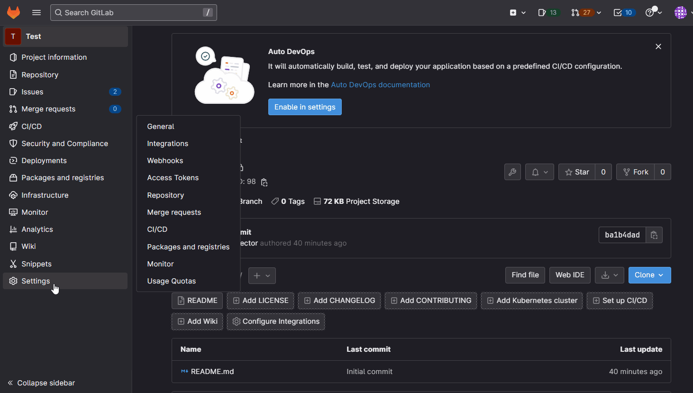

# gitlab2sheet

## GitLab Issue Tracker

This project allows you to track issues in all GitLab projects with the assignee, labels, epic and spent time.

## Requirements

Setup webhook in gitlab, the URL must be the ip adress where the apps are running




## For production

``` shell
docker run -p 3001:3000 -d gitimelab:latest
```

## For devellopement

``` shell
cd src && poetry run functions-framework --target=push_to_sheet --debug --port=3000
```
